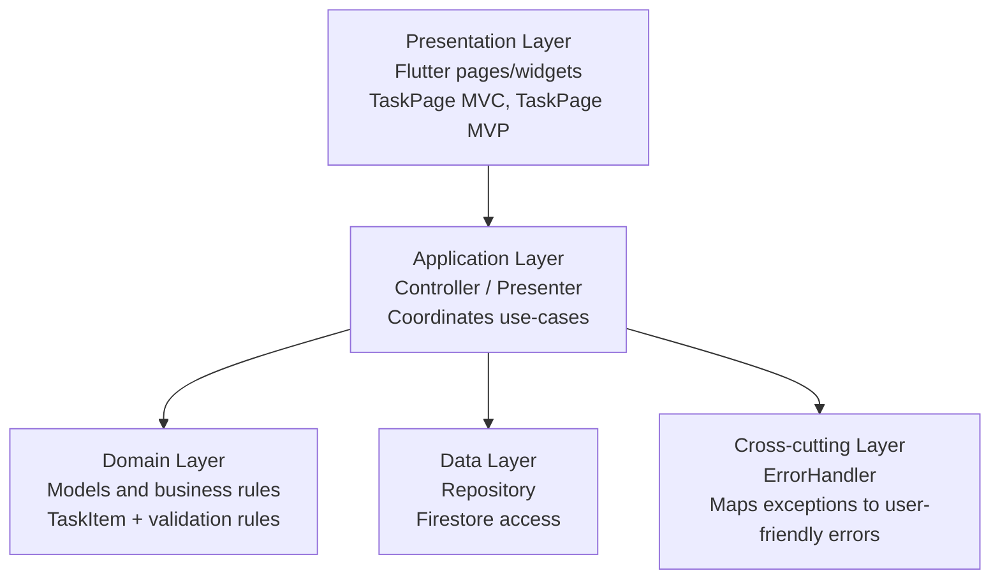

# Day 35: Layer Diagram and Responsibilities

## Layer Diagram

## Responsibilities

### Presentation Layer

- Renders state and user controls only.
- Sends user intents to application layer methods.
- Contains no data access and no storage logic.

### Application Layer

- Implements screen use-cases: loadTasks, addTask, updateTask, deleteTask, filters.
- Maintains screen state transitions (loading, success, error).
- Orchestrates calls to repository and error handler.

### Domain Layer

- Defines task entities and business-oriented data contracts.
- Holds rules like title validation and tag normalization input expectations.
- Stays independent from Flutter widgets.

### Data Layer

- Executes Firestore reads/writes through repository.
- Builds queries for filters/pagination.
- Converts persistence records into domain models.

### Cross-cutting Layer (ErrorHandler)

- Centralizes error mapping for consistent messages.
- Prevents duplicated error formatting in UI.
- Reused by MVC Controller and MVP Presenter.

## Project Mapping

- Presentation:
  - lib/pages/task_page.dart
  - lib/pages/task_page_mvp.dart
- Application:
  - lib/notes/notes_controller.dart
  - lib/notes/mvp/notes_presenter.dart
- Domain:
  - lib/notes/task_item.dart
  - lib/notes/notes_view_state.dart
  - lib/notes/mvp/notes_mvp_state.dart
- Data:
  - lib/notes/notes_repository.dart
- Cross-cutting:
  - lib/core/error_handler.dart
